# Scheduler Test Framework - Comprehensive Implementation Plan

## Gantt Chart for Parallel Development

```mermaid
gantt
    title Scheduler Test Framework Development
    dateFormat  X
    axisFormat %d

    section Phase 1: Foundation
    Planning Document         :done, plan, 0, 1
    Core Types & Interfaces   :active, types, 1, 3
    
    section Phase 2: Core Components (Parallel)
    K-Solution Generator      :agent1, 3, 8
    Availability Generators   :agent2, 3, 7
    Test Case Writers         :agent3, 4, 8
    Performance Framework     :agent4, 3, 7
    K-Solvability Engine      :agent5, 4, 9
    Integration Scripts       :agent6, 5, 8
    
    section Phase 3: Integration
    Component Integration     :integrate, 8, 10
    Final Testing             :testing, 10, 12
    Documentation             :docs, 11, 12
```



## Project Overview

### Goal
Create a comprehensive hardness testing framework for the new TimeBlock-based scheduler with minute-precision scheduling. Generate test cases with varying difficulty levels and exact k-solvability guarantees.

### Key Requirements
1. **Remove Old Tests**: Replace old boolean grid tests with TimeBlock-based tests
2. **K-Solvability**: Generate scenarios with exactly k solutions (k=0,1,5,10,100+)
3. **Hardness Levels**: Progressive difficulty from trivial to near-impossible
4. **Performance**: Target 50 students solved in < 2 seconds
5. **No Heuristics Initially**: Pure constraint satisfaction testing

## Parallel Agent Task Breakdown

### Agent 1: Core Test Generator
**Priority**: High | **Estimated Time**: 5 hours
**Dependencies**: None

**Deliverables:**
- `lib/scheduling/test-generator/core.ts`
- `lib/scheduling/test-generator/k-solution-generator.ts`
- `lib/scheduling/test-generator/difficulty-calculator.ts`

**Specifications:**
```typescript
interface DifficultyParams {
  studentCount: number;        // 2-50
  overlapRatio: number;        // 0.0-1.0 (how much students overlap)
  fragmentationLevel: number;  // 0.0-1.0 (how broken up time is)
  packingDensity: number;      // 0.0-1.0 (required/available ratio)
  durationVariety: number;     // 1-4 (number of different durations)
  constraintTightness: number; // 0.0-1.0 (how strict constraints are)
}

interface TestCaseConfig {
  targetK: number;           // Target number of solutions
  difficulty: DifficultyParams;
  metadata: {
    description: string;
    expectedSolveTime: number;
    category: 'basic' | 'easy' | 'medium' | 'hard' | 'impossible';
  };
}
```

**Key Algorithms:**
1. **K-Solution Binary Search**: Adjust constraint tightness to hit exact k
2. **Solution Counting**: Monte Carlo estimation for large cases
3. **Difficulty Scoring**: Composite metric based on all parameters

### Agent 2: Availability & Constraint Generators
**Priority**: High | **Estimated Time**: 4 hours
**Dependencies**: Core interfaces from Agent 1

**Deliverables:**
- `lib/scheduling/test-generator/generators/availability-generator.ts`
- `lib/scheduling/test-generator/generators/constraint-generator.ts`
- `lib/scheduling/test-generator/generators/student-generator.ts`

**Availability Patterns:**
```typescript
class AvailabilityGenerator {
  generateWorkingHours(): WeekSchedule     // 9-5 with lunch break
  generateEvening(): WeekSchedule          // 6-9pm slots
  generateFragmented(): WeekSchedule       // Many small blocks
  generatePeakTime(): WeekSchedule         // Everyone wants 4-6pm
  generateSparse(): WeekSchedule           // Very limited availability
  generateRealistic(): WeekSchedule        // Mixed patterns
}
```

**Student Types:**
- Morning person (7-11am available)
- Evening person (5-9pm available)
- Flexible (9-6pm available)
- Weekend only
- Specific days only
- Limited duration preferences

### Agent 3: Test Case Writers
**Priority**: Medium | **Estimated Time**: 4 hours
**Dependencies**: Generators from Agent 2

**Deliverables:**
- `lib/scheduling/tests/hardness/basic-hardness.test.ts`
- `lib/scheduling/tests/hardness/generated-easy.test.ts`
- `lib/scheduling/tests/hardness/generated-medium.test.ts`
- `lib/scheduling/tests/hardness/generated-hard.test.ts`
- `lib/scheduling/tests/hardness/generated-impossible.test.ts`

**Test Categories:**
1. **Basic (Hand-written)**:
   - 2-3 students, exact fit
   - Single solution puzzles
   - Obviously impossible cases

2. **Easy (k > 100)**:
   - High flexibility
   - Short lessons, long windows
   - Multiple valid arrangements

3. **Medium (10 < k < 100)**:
   - Realistic constraints
   - Mix of durations
   - Some conflicts

4. **Hard (1 ≤ k ≤ 10)**:
   - Tight packing
   - Critical path scheduling
   - Exact k solutions

5. **Impossible (k = 0)**:
   - Over-constrained
   - Provably unsolvable

### Agent 4: Performance & Benchmarking
**Priority**: Medium | **Estimated Time**: 4 hours
**Dependencies**: Test cases from Agent 3

**Deliverables:**
- `lib/scheduling/tests/performance/solver-performance.test.ts`
- `lib/scheduling/tests/performance/scaling.test.ts`
- `lib/scheduling/tests/performance/memory-usage.test.ts`

**Performance Metrics:**
```typescript
interface PerformanceMetrics {
  solvingTimeMs: number;
  backtrackCount: number;
  constraintChecks: number;
  memoryUsageMB: number;
  solutionQuality: number;
  cacheHitRate?: number;
}
```

**Scaling Tests:**
- 10, 20, 30, 40, 50 student scenarios
- Linear vs exponential growth analysis
- Memory usage profiling
- Performance regression detection

### Agent 5: K-Solvability Framework
**Priority**: High | **Estimated Time**: 5 hours
**Dependencies**: Core from Agent 1

**Deliverables:**
- `lib/scheduling/test-generator/k-solver/solution-counter.ts`
- `lib/scheduling/test-generator/k-solver/monte-carlo-estimator.ts`
- `lib/scheduling/test-generator/k-solver/constraint-graph-analyzer.ts`

**Solution Counting Strategies:**
```typescript
class SolutionCounter {
  // Exact counting for small cases (< 10 students)
  countExact(teacher: TeacherConfig, students: StudentConfig[]): number;
  
  // Statistical sampling for larger cases
  estimateViaSampling(teacher: TeacherConfig, students: StudentConfig[], samples: number): number;
  
  // Constraint graph analysis for bounds
  calculateBounds(teacher: TeacherConfig, students: StudentConfig[]): {min: number, max: number};
  
  // Generate case with exactly k solutions
  generateKSolutionCase(k: number, studentCount: number): TestCase;
}
```

### Agent 6: Integration & Scripts
**Priority**: Low | **Estimated Time**: 3 hours
**Dependencies**: All other agents

**Deliverables:**
- `lib/scheduling/test-generator/scripts/generate-fixtures.ts`
- `lib/scheduling/test-generator/fixtures/` (generated JSON files)
- `lib/scheduling/test-generator/index.ts` (main exports)

**Fixture Generation:**
```bash
# Generate all test fixtures
pnpm tsx lib/scheduling/test-generator/scripts/generate-fixtures.ts

# Generate specific category
pnpm tsx lib/scheduling/test-generator/scripts/generate-fixtures.ts --category hard --count 50
```

**Generated Fixtures:**
- `k-0-impossible.json` (20 cases)
- `k-1-unique.json` (30 cases)
- `k-5-tight.json` (25 cases)
- `k-10-moderate.json` (20 cases)
- `k-100-flexible.json` (15 cases)

## Shared Interfaces & Types

### Core Types (All Agents Use)
```typescript
interface TestCase {
  id: string;
  description: string;
  teacher: TeacherConfig;
  students: StudentConfig[];
  expectedSolutions: number;
  difficulty: DifficultyParams;
  metadata: TestCaseMetadata;
}

interface TestCaseMetadata {
  category: 'basic' | 'easy' | 'medium' | 'hard' | 'impossible';
  studentCount: number;
  estimatedSolveTimeMs: number;
  constraints: string[];
  tags: string[];
  createdAt: Date;
  generatedBy: 'manual' | 'algorithm';
}

interface TestSuite {
  name: string;
  description: string;
  cases: TestCase[];
  totalCases: number;
  categories: Record<string, number>;
}
```

### File Structure
```
lib/scheduling/
├── test-generator/
│   ├── core.ts                    # Agent 1
│   ├── k-solution-generator.ts    # Agent 1
│   ├── difficulty-calculator.ts   # Agent 1
│   ├── generators/
│   │   ├── availability-generator.ts  # Agent 2
│   │   ├── constraint-generator.ts    # Agent 2
│   │   └── student-generator.ts       # Agent 2
│   ├── k-solver/
│   │   ├── solution-counter.ts        # Agent 5
│   │   ├── monte-carlo-estimator.ts   # Agent 5
│   │   └── constraint-graph-analyzer.ts # Agent 5
│   ├── scripts/
│   │   └── generate-fixtures.ts       # Agent 6
│   ├── fixtures/                      # Agent 6
│   └── index.ts                       # Agent 6
├── tests/
│   ├── hardness/                      # Agent 3
│   │   ├── basic-hardness.test.ts
│   │   ├── generated-easy.test.ts
│   │   ├── generated-medium.test.ts
│   │   ├── generated-hard.test.ts
│   │   └── generated-impossible.test.ts
│   └── performance/                   # Agent 4
│       ├── solver-performance.test.ts
│       ├── scaling.test.ts
│       └── memory-usage.test.ts
```

## Quality Standards

### Code Quality
- TypeScript strict mode
- 100% type coverage
- JSDoc comments for all public APIs
- Unit tests for all generators
- Integration tests for workflows

### Test Quality
- Each generated test case must be validated
- Solution counts verified where possible
- Performance benchmarks included
- Edge cases explicitly tested
- Regression tests for known issues

### Performance Targets
- 50 students: < 2 seconds
- 30 students: < 500ms
- 20 students: < 200ms
- 10 students: < 50ms

## Success Criteria

1. **✅ Old Test Removal**: All old boolean grid tests replaced
2. **✅ K-Solvability**: Can generate cases with exact k solutions
3. **✅ Comprehensive Coverage**: Tests from trivial to impossible
4. **✅ Performance Validation**: Meets all timing targets
5. **✅ Reproducible**: Seeded generation for consistent results
6. **✅ Maintainable**: Clear architecture and documentation

## Execution Notes for Agents

### Communication Protocol
- Each agent should update this document with progress
- Mark deliverables as complete when finished
- Note any deviations from the specification
- Document any issues or blockers

### Dependencies
- Agent 1 (Core) should complete interfaces first
- Agent 2 (Generators) depends on core interfaces
- Agent 3 (Tests) depends on generators
- Agent 4 (Performance) can start after basic tests exist
- Agent 5 (K-Solver) can work parallel to others
- Agent 6 (Integration) waits for most components

### Testing Instructions
- Use vitest for all test files
- Include performance assertions
- Test with different solver configurations
- Validate against existing solver implementation

---

## Implementation Status

### ✅ Completed Components

#### Agent 1: Core Test Generator
- ✅ `lib/scheduling/test-generator/core.ts` - Complete with TestCaseGenerator
- ✅ `lib/scheduling/test-generator/k-solution-generator.ts` - K-solution targeting
- ✅ `lib/scheduling/test-generator/difficulty-calculator.ts` - Difficulty metrics

#### Agent 2: Availability & Constraint Generators  
- ✅ `lib/scheduling/test-generator/generators/availability-generator.ts` - Availability patterns
- ✅ `lib/scheduling/test-generator/generators/constraint-generator.ts` - Constraint generation
- ✅ `lib/scheduling/test-generator/generators/student-generator.ts` - Student types

#### Agent 3: Test Case Writers
- ✅ `lib/scheduling/tests/hardness/basic-hardness.test.ts` - Hand-written cases
- ✅ `lib/scheduling/tests/hardness/generated-easy.test.ts` - Easy generated tests
- ✅ `lib/scheduling/tests/hardness/generated-medium.test.ts` - Medium tests  
- ✅ `lib/scheduling/tests/hardness/generated-hard.test.ts` - Hard tests
- ✅ `lib/scheduling/tests/hardness/generated-impossible.test.ts` - Impossible tests

#### Agent 4: Performance & Benchmarking
- ✅ `lib/scheduling/tests/performance/solver-performance.test.ts` - Performance metrics
- ✅ `lib/scheduling/tests/performance/scaling.test.ts` - Scaling analysis
- ✅ `lib/scheduling/tests/performance/memory-usage.test.ts` - Memory profiling

#### Agent 5: K-Solvability Framework
- ✅ `lib/scheduling/test-generator/k-solver/solution-counter.ts` - Exact & estimated counting
- ✅ `lib/scheduling/test-generator/k-solver/monte-carlo-estimator.ts` - Statistical sampling
- ✅ `lib/scheduling/test-generator/k-solver/constraint-graph-analyzer.ts` - Graph analysis

#### Agent 6: Integration & Scripts  
- ✅ `lib/scheduling/test-generator/scripts/generate-fixtures.ts` - CLI fixture generator
- ✅ `lib/scheduling/test-generator/fixtures/` - Generated JSON test cases
- ✅ `lib/scheduling/test-generator/index.ts` - Unified exports
- ✅ Integration validation and testing

## Usage Instructions

### Running the Complete Framework

```bash
# Install dependencies (if not already done)
pnpm install

# Generate all test fixtures with default counts
pnpm tsx lib/scheduling/test-generator/scripts/generate-fixtures.ts

# Generate specific category with custom count
pnpm tsx lib/scheduling/test-generator/scripts/generate-fixtures.ts --category k-1-unique --count 50

# Generate with reproducible seed
pnpm tsx lib/scheduling/test-generator/scripts/generate-fixtures.ts --seed 12345 --verbose

# Generate to custom directory
pnpm tsx lib/scheduling/test-generator/scripts/generate-fixtures.ts --output ./custom-fixtures/
```

### Using the Framework in Code

```typescript
import {
  createCompleteTestFramework,
  TestCaseGenerator,
  type TestCase,
  type DifficultyParams
} from 'lib/scheduling/test-generator';

// Create framework optimized for 20 students
const framework = createCompleteTestFramework(20);

// Generate a test case
const result = await framework.generator.generateTestCase({
  targetK: 5,
  difficulty: {
    studentCount: 10,
    overlapRatio: 0.6,
    fragmentationLevel: 0.4,
    packingDensity: 0.8,
    durationVariety: 2,
    constraintTightness: 0.7
  },
  metadata: {
    description: 'Custom test case',
    expectedSolveTime: 300,
    category: 'medium'
  }
});

if (result.success) {
  const testCase = result.testCase!;
  // Use test case with scheduler
}
```

### Generated Test Fixtures

The framework generates the following fixture files:

- **k-0-impossible.json** (20 cases) - Over-constrained scenarios with no solutions
- **k-1-unique.json** (30 cases) - Tightly constrained with exactly one solution  
- **k-5-tight.json** (25 cases) - Moderately constrained with few solutions
- **k-10-moderate.json** (20 cases) - Balanced scenarios with moderate flexibility
- **k-100-flexible.json** (15 cases) - High flexibility with many solutions

### Running Tests

```bash
# Run all hardness tests
pnpm test lib/scheduling/tests/hardness/

# Run performance tests  
pnpm test lib/scheduling/tests/performance/

# Run integration tests
pnpm test lib/scheduling/test-generator/tests/integration.test.ts
```

### Architecture Overview

The framework provides:

1. **Core Generation** - Base test case creation with configurable difficulty
2. **K-Solution Targeting** - Generate cases with exact solution counts
3. **Availability Patterns** - Realistic teacher/student availability generation
4. **Constraint Management** - Flexible constraint generation and analysis
5. **Solution Counting** - Exact counting for small cases, estimation for large
6. **Performance Monitoring** - Comprehensive performance metrics and benchmarking
7. **Fixture Management** - CLI tools for generating reproducible test sets

### Key Features

- **Minute-precision scheduling** with TimeBlock-based data model
- **Progressive difficulty levels** from trivial to impossible  
- **K-solvability guarantees** with exact solution count targets
- **Realistic constraints** including breaks, consecutive lessons, availability conflicts
- **Performance validation** with sub-2-second targets for 50 students
- **Reproducible generation** with seeded randomization
- **Comprehensive validation** with integration tests

---

**Document Status**: ✅ Complete - All 6 Agents Implemented
**Framework Status**: ✅ Production Ready
**Next Action**: Use framework for scheduler development and testing
**Total Implementation Time**: 12 hours across 6 parallel agents