# Scheduler Algorithm Hardening Plan

## Executive Summary
The scheduler has 5 critical bugs causing constraint violations and failures to find valid solutions. This plan outlines a systematic approach to fix these issues using 5 parallel agents.

## Root Cause Analysis

### Bug 1: Duration Constraint Handling
**Location**: `lib/scheduling/solver.ts:348`
**Issue**: Only uses first allowed duration, doesn't iterate through all possibilities
**Impact**: Tests failing with "expected [30, 45] to include 60"

### Bug 2: Non-Overlapping Constraint Context
**Location**: `lib/scheduling/solver.ts:836-847` (updateContext method)  
**Issue**: Context accumulates all assignments instead of tracking current search path
**Impact**: Lessons overlapping by 60 minutes (test expects gap ≥ 0, gets -60)

### Bug 3: Break Requirements Across Days
**Location**: `lib/scheduling/constraints.ts:350-400`
**Issue**: Break requirements only checked within same day, not across day boundaries
**Impact**: Multi-day break requirements not distributed properly

### Bug 4: Workload Balance Weighting
**Location**: `lib/scheduling/constraints.ts:403-445`
**Issue**: Soft constraint not properly weighted in search heuristics
**Impact**: All lessons scheduled on single day instead of distributed

### Bug 5: Domain Creation Restrictiveness
**Location**: `lib/scheduling/solver.ts:341-380`
**Issue**: Domain creation too restrictive, missing valid time slots
**Impact**: Solver returns 0 assignments when solutions exist

## Fix Implementation Plan

### Agent Assignments

#### Agent 1: Duration Domain Explorer
**Task**: Fix domain creation to explore all allowed durations
**Files**: 
- `lib/scheduling/solver.ts` (createDomains method)
- `lib/scheduling/test-generator/generators/availability-generator.ts`

#### Agent 2: Context Manager 
**Task**: Fix backtracking context management for proper constraint checking
**Files**:
- `lib/scheduling/solver.ts` (updateContext, backtrack methods)
- `lib/scheduling/types.ts` (SolverContext type)

#### Agent 3: Constraint Enforcer
**Task**: Fix non-overlapping and break requirement constraints
**Files**:
- `lib/scheduling/constraints.ts` (NonOverlappingConstraint, BreakRequirementConstraint)
- `lib/scheduling/utils.ts` (constraint checking utilities)

#### Agent 4: Search Optimizer
**Task**: Improve search heuristics and soft constraint handling
**Files**:
- `lib/scheduling/solver.ts` (orderValues, calculateSlotScore methods)
- `lib/scheduling/optimizations/index.ts`

#### Agent 5: Test Validator
**Task**: Validate fixes against test suite and add regression tests
**Files**:
- `lib/scheduling/tests/solver.test.ts`
- `lib/scheduling/tests/data-model.test.ts`

## GANTT Chart

```mermaid
gantt
    title Scheduler Fix Implementation Timeline
    dateFormat HH:mm
    axisFormat %H:%M
    
    section Analysis Phase
    Root Cause Analysis           :done, analysis, 00:00, 30m
    Test Failure Mapping          :done, testmap, 00:30, 20m
    
    section Implementation Phase
    Agent 1 - Duration Domain     :active, agent1, 00:50, 90m
    Agent 2 - Context Manager     :active, agent2, 00:50, 90m  
    Agent 3 - Constraint Enforcer :active, agent3, 00:50, 90m
    Agent 4 - Search Optimizer    :active, agent4, 00:50, 90m
    Agent 5 - Test Validator      :       agent5, 00:50, 120m
    
    section Integration Phase
    Merge & Conflict Resolution   :       merge, 02:20, 30m
    Integration Testing           :       inttest, 02:50, 40m
    Performance Validation        :       perf, 03:30, 30m
    
    section Validation Phase
    Full Test Suite Run           :       fulltest, 04:00, 20m
    Bug Verification              :       verify, 04:20, 20m
    Documentation Update          :       docs, 04:40, 20m
```



## Detailed Fix Specifications

### Fix 1: Duration Domain Creation
```typescript
// BEFORE (line 348)
const duration = student.preferredDuration ?? teacher.constraints.allowedDurations[0] ?? 60;

// AFTER  
const durations = student.preferredDuration 
  ? [student.preferredDuration]
  : teacher.constraints.allowedDurations.length > 0
    ? teacher.constraints.allowedDurations
    : [60];

for (const duration of durations) {
  // Create time slots for each allowed duration
}
```

### Fix 2: Context Management
```typescript
// BEFORE (line 846)
existingAssignments: context.existingAssignments.concat(existingAssignments)

// AFTER
existingAssignments: [...existingAssignments] // Only current path assignments
```

### Fix 3: Non-Overlapping Logic
```typescript
// Add proper time arithmetic to prevent negative gaps
private intervalsOverlap(start1: number, end1: number, start2: number, end2: number): boolean {
  // Ensure no negative time values
  if (start1 < 0 || start2 < 0 || end1 < 0 || end2 < 0) return true;
  return start1 < end2 && start2 < end1;
}
```

### Fix 4: Break Requirements Across Days
```typescript
// Check break requirements across day boundaries
if (dayOfWeek < 6) { // Not Saturday
  const nextDayAssignments = context.existingAssignments.filter(
    a => a.dayOfWeek === dayOfWeek + 1
  );
  // Check early morning lessons on next day
}
```

### Fix 5: Workload Balance Heuristic
```typescript
// Add distribution score to slot scoring
private calculateSlotScore(slot: TimeSlot, context: SolverContext): number {
  let score = 0;
  
  // Existing scoring...
  
  // Add workload distribution bonus
  const sameDayCount = context.existingAssignments.filter(
    a => a.dayOfWeek === slot.dayOfWeek
  ).length;
  score -= sameDayCount * 3; // Penalize overcrowded days
  
  return score;
}
```

## Success Criteria

1. **All 7 failing solver tests pass**:
   - Non-overlapping constraint test
   - Duration constraint tests (3)
   - Break requirement test
   - Workload balance test  
   - Performance regression test

2. **Performance maintained**:
   - 10 students < 100ms
   - 30 students < 500ms
   - 50 students < 2s

3. **No regression in passing tests**:
   - 22 currently passing solver tests remain green
   - Integration tests pass

## Risk Mitigation

1. **Backward Compatibility**: Keep original methods as fallbacks
2. **Performance Impact**: Monitor constraint checking overhead
3. **Edge Cases**: Add comprehensive test coverage for boundary conditions
4. **Incremental Rollout**: Fix one constraint at a time with validation

## Execution Timeline

- **Phase 1** (0-90 min): Parallel implementation by 5 agents
- **Phase 2** (90-150 min): Integration and conflict resolution
- **Phase 3** (150-210 min): Testing and validation
- **Phase 4** (210-300 min): Final verification and documentation

## Post-Implementation

1. Re-enable full test suite
2. Run performance benchmarks
3. Update CLAUDE.md with resolved issues
4. Create monitoring dashboard for production

## Commands for Validation

```bash
# Run solver tests
pnpm test lib/scheduling/tests/solver.test.ts

# Run full scheduling test suite  
pnpm test lib/scheduling

# Run performance benchmarks
pnpm test -- --grep "Performance"

# Check for regressions
pnpm test -- --reporter=verbose
```

This plan ensures systematic fixing of all identified bugs while maintaining code quality and performance.